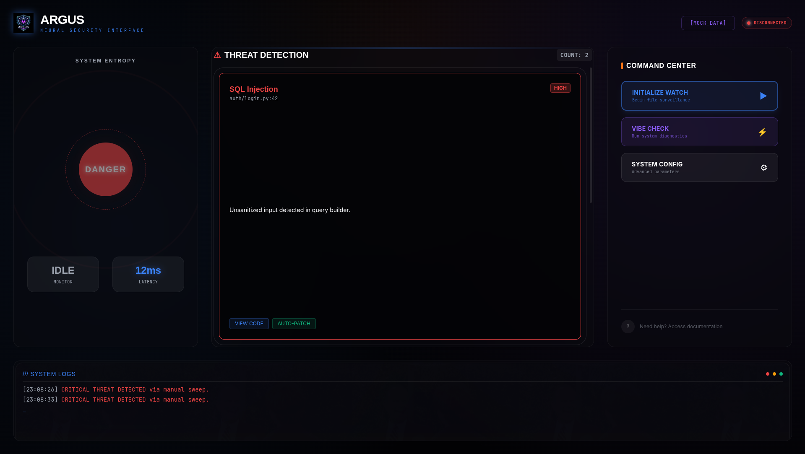

# ARGUS // Neural Security Interface

### Autonomous Vulnerability Detection & Remediation System

**Argus** is a next-generation security auditing tool that transforms static code analysis into a real-time, interactive neural interface. Designed with a "Deep Space" aesthetic, it provides a seamless dashboard for monitoring file changes, detecting vulnerabilities, and applying AI-driven patches instantly.



---

## 🌌 Core Features

### 🛡️ Real-Time Surveillance
- **Live File Monitoring**: Watchdog-powered daemon creates an active perimeter around your codebase (`target_code/`).
- **Instant Detection**: File changes trigger immediate security scans using advanced regex and AST analysis.

### 🧠 Neural Auto-Patching
- **AI-Driven Remediation**: Powered by Google Gemini 1.5 Pro/Flash.
- **One-Click Fixes**: Generates context-aware security patches for detected vulnerabilities (e.g., SQL Injection, Hardcoded Secrets).
- **Interactive UI**: Watch the "patching" process with real-time feedback animations.

### 💠 Immersive Interface
- **EternoCloud Aesthetic**: Deep void backgrounds, bioluminescent accents, and glassmorphism.
- **Dynamic Visuals**: Mesh gradients, glowing vulnerability cards, and "text shimmer" loading states.
- **System Entropy**: Visual status orb tracks system health and threat levels in real-time.

---

## 🛠️ Tech Stack

- **Backend**: Python 3.10+, FastAPI, Socket.IO, Watchdog, Google GenAI
- **Frontend**: React, Vite, Tailwind CSS v4
- **Design**: Framer Motion, Lucide React, Custom CSS Variables

---

## 🚀 Getting Started

### Prerequisites
- Node.js & npm
- Python 3.10+
- Google Gemini API Key

### Installation

1.  **Clone the Repository**
    ```bash
    git clone https://github.com/NexionisJake/Argus.git
    cd Argus
    ```

2.  **Backend Setup**
    ```bash
    python -m venv venv
    source venv/bin/activate
    pip install -r requirements.txt
    ```

3.  **Frontend Setup**
    ```bash
    cd web/frontend
    npm install
    ```

### Running the System

1.  **Start the Neural Core (Backend)**
    ```bash
    # In project root
    python web/backend/main.py
    ```

2.  **Launch the Interface (Frontend)**
    ```bash
    # In web/frontend
    npm run dev
    ```

Access the dashboard at `http://localhost:5173`.

---

## 📂 Project Structure

```
argus/
├── agents/             # AI Agents (Patcher, Scanner)
├── config/             # Configuration modules
├── web/
│   ├── backend/        # FastAPI Server & WebSocket Hub
│   └── frontend/       # React/Vite UI
├── target_code/        # Directory monitored for vulnerabilities
└── requirements.txt    # Python dependencies
```

---

## 📜 License

This project is licensed under the MIT License - see the [LICENSE](LICENSE) file for details.

---

> *"The eyes of Argus never sleep."*
